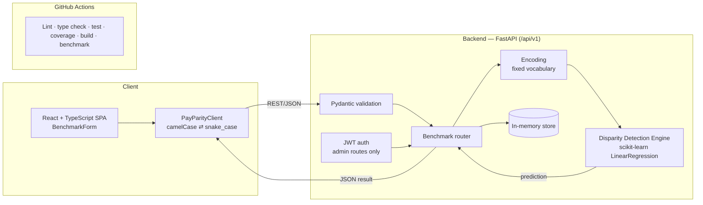

# PayParity — System Architecture

**Status:** Final release (course). Describes the system as built.

## 1. Overview

PayParity takes a salary profile (role, location, experience, department,
current pay), predicts a fair salary from legitimate factors with a
regression model, and flags large gaps. The frontend, API, and model run
as one working round trip. Planned pieces that are not built yet are
listed separately in section 6 so this document matches the code.

## 2. System diagram



## 3. Components

**Frontend (`frontend/`)**
React 18 + TypeScript, built with Vite and tested with Vitest.
`BenchmarkForm` collects input and shows the result. `PayParityClient`
is the only code that talks to the API and translates field names at the
boundary. The API base URL comes from `VITE_API_BASE_URL`.

**API layer (`backend/app/routers/benchmark.py`)**
FastAPI router under `/api/v1`:

| Endpoint | Purpose |
|---|---|
| `POST /benchmark` | Encode input, predict, compute gap, flag, save, return |
| `GET /benchmark/{id}` | Return a saved result |
| `GET /roles` | Search known job titles |
| `POST /salary-data` | Admin-only bulk import (accepts records; not yet used for training) |

Request and response shapes live in `schemas.py` (Pydantic). Invalid
input returns 422 before reaching the handler.

**Auth (`backend/app/auth.py`)**
Stateless JWT (HS256) verification as a FastAPI dependency. Only the bulk
import route requires it, with an `admin` role claim. Missing or bad
tokens return 401; wrong role returns 403.

**Encoding (`backend/app/model/encoding.py`)**
Maps job title, location, and department to integer codes using fixed
vocabularies (`v2-fixed-vocab`). Unknown values map to a reserved code,
so the table never grows at runtime. The live API encodes through these
functions; the model's reference rows use hand-entered codes that must
stay in line with this vocabulary.

**Disparity Detection Engine (`backend/app/model/predictor.py`)**
A `SalaryPredictor` Protocol with one implementation,
`RegressionSalaryPredictor`, a scikit-learn `LinearRegression` fitted on
10 hand-coded reference rows at startup. It runs in-process as a direct function
call and is reused as a singleton. The router computes:

```
gap_percent = (current_salary - predicted) / predicted * 100
flagged     = |gap_percent| > 5.0
```

If prediction raises, the API returns 503 with `retryable: true`.

**Storage (`backend/app/store.py`)**
An in-process dictionary keyed by benchmark id. Callers only use
`save_benchmark` and `get_benchmark`, so swapping in a database is
contained to this module.

**Privacy**
`gender` is accepted on requests but only read inside the handler. It is
never saved to the store or logged. `test_gender_is_not_persisted`
checks this.

## 4. Key design decisions

| Decision | Reason | Trade-off |
|---|---|---|
| Model in-process, not a separate service | Simple, ~2 ms per request, no network hop | Model and API scale together |
| Protocol interface around the model | Retrain or swap models without changing the API | One more layer of indirection |
| Fixed encoding vocabulary | Bounded memory, stable codes | New roles need a code change |
| Stateless JWT for admin routes | Easy to scale across instances | No issuance/login flow yet |
| Versioned `/api/v1` paths | Room for breaking changes later | None significant |

## 5. CI pipeline

`.github/workflows/ci.yml` runs on pushes and PRs to `main`.

- **Frontend job:** `npm ci`, ESLint, `tsc --noEmit`, Vitest, Vite build
- **Backend job:** pip install, flake8, black, pytest with coverage
  (uploaded as an artifact), `scripts/benchmark.py`

Branch protection and review rules are in `BRANCHING_STRATEGY.md`.

## 6. Planned but not built

- **PostgreSQL** to replace the in-memory store
- **AWS deployment** and a CD stage in the pipeline
- **Real training data** fed from `POST /salary-data`, with retraining
- **Statistical threshold and interval** from cross-validated error,
  replacing the fixed 5% and ±$8,000
- **Model artifact versioning**, saving the encoder vocabulary with each
  trained model
- **Token issuance** and managed secrets
- **Restricted CORS** for the deployed frontend origin
